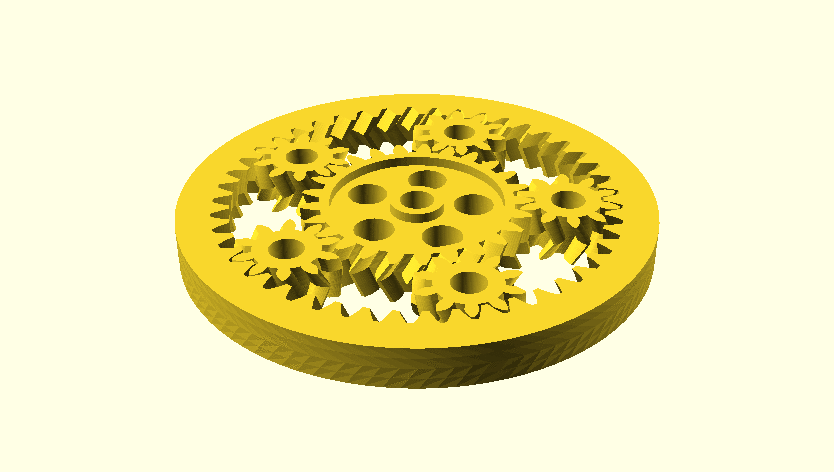
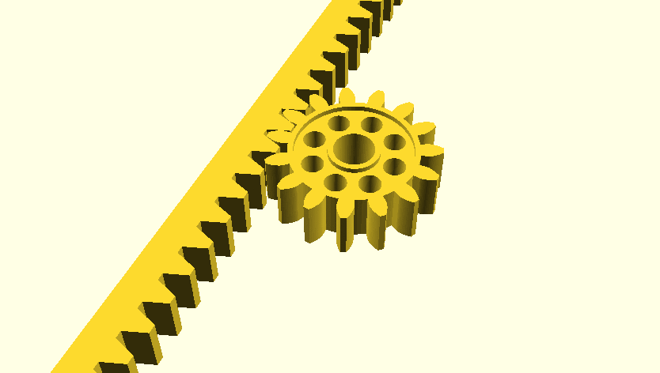
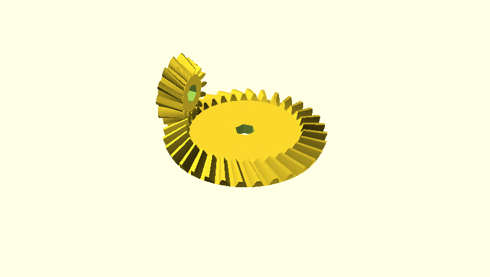
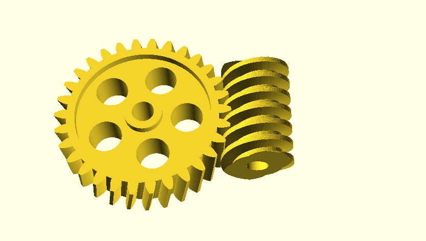

# Getriebe
Gears Library for OpenSCAD


## Differences in Poikilos' fork
- For translation progress, see the "Tasks" section below.
- The English branch is now the default branch. It only has English, so finding information is easier for English-speaking users.
  - To keep track of upstream changes (such as by viewing commit diffs), the new upstream-janssen86 branch will always match janssen86's version.
- Features and fixes from [Erhannis' fork](https://github.com/Erhannis/getriebe) are included (Erhannis' is based on janssen86's version 2.3).

### Translation methods
To reduce work and allow for easier comparison between forks, parameter names will be based on [openscad gears (english)](https://www.thingiverse.com/thing:2123204) by [benengel](https://www.thingiverse.com/benengel) February 20, 2017 ([Creative Commons Attribution 4.0 International](https://creativecommons.org/licenses/by/4.0/) (CC BY 4.0)) except
fixed (to match proper engineering terms in the original janssen86 post [ignoring the issue where the second english section containing "zahnstange" should instead contain "zahnstange_und_ritzel"] or elsewhere):
- `game` becomes `play` `*`
- `scale_of` becomes `module_arc_length` `*`
- `spur_gear` becomes `rack` `*`

`*`: This also affects items translated by Google Translate [See justgetalang below] not provided by benengel.

#### Lexing
Lark
- There is already a OpenSCAD parser for Lark: <https://gitlab.com/bath_open_instrumentation_group/sca2d>

PLY (Pure Python implementation of Lex-YACC)
- Lexographical analysis of a SCAD file could be done using the spec included within FreeCAD since FreeCAD uses.
- It provides tokenization not contextual parsing or an AST (Abstract Syntax Tree).

YACC
(Yet Another Compiler Compiler)
- OpenSCAD itself uses the C++ version of YACC, which apparently generates /parser_yacc.cpp as that file is listed in the .gitignore file.

Bison
- GNU Bison/Flex is fast but is doesn't have a native Python implementation so it is only available in Python using a wrapper: <https://pypi.org/project/pybison/>.
- There is a bison.pri file for OpenSCAD as a part of prototypable's fork of OpenSCAD which is designed to operate as an OpenSCAD backend for prototypable: <https://github.com/prototypable/openscad-backend/blob/master/bison.pri>.

Antlr
- A BNF (Backus-Naur Form) fils is available at <https://github.com/GilesBathgate/RapCAD/blob/master/doc/openscad.bnf>.
  - g4 may be the file extension also. See <https://faun.pub/introduction-to-antlr-python-af8a3c603d23>.
- Antlr can be used in Python but is primarily in the Java ecosystem. See <https://www.antlr.org/about.html>.

JavaScript
- There are at least 2 NPM modules for parsing OpenSCAD as well as [openscad-wasm](https://hackaday.com/2022/03/14/the-noble-effort-to-put-openscad-in-the-browser/).


#### Run auto-translation
```
python3 ./lang/translate.py
```

#### justgetalang
(requires <https://github.com/poikilos/justgetalang>)
```
./langdump.py Getriebe.scad > lang/upstream/de.py
cd lang/upstream
python -m pip install googletrans==4.0.0rc1 --user
~/git/justgetalang/justgetalang.py --extension py --from de --to en --dictionary data --languages-key comments
# ^ Doesn't need internet if processing the upstream Getriebe.scad since the trCache.json for justgetalang is included.
# usually add:
# > en.py
```

##### Tasks
To translate to English (recreate gearlib.scad), see the "Run auto-translation" section.

- [ ] Manually process trCache.json to reflect English engineering terms.
  - [x] `game` becomes `play`
- [ ] Implement the standard output of the justgetalang command above into "lang/upstream/en.py".
- For language files:
  - [ ] Merge "lang/upstream/*.py" into "lang/*.py"
  - [ ] Add benengel's variable names to "lang/*.py"
- [ ] Utilize "lang/*.py" files to create an auto-translation script, from largest to smallest string to avoid changing words within phrases which would make the phrases not able to be found.

## Terms
Pitch Circle Diameter (PCD) is the circle where the widening part of the spur starts becoming narrower (See image at link below).

> Module
> The length in mm of the pitch circle diameter per tooth.
> MOD = PCD / N
>
> Number of Teeth
> The number of teeth on the gear.
> N = PCD / MOD
>
> Pitch Circle Diameter
> The diameter of the pitch circle.
> PCD = N x MOD
>
> Outside Diameter
> The outside diameter of the gear.
> OD = (N + 2) x MOD
>
> Center Distance
> The distance between the axes of two gears in mesh.
> C = PCD(g) + PCD(p)
>     ---------------
>           2
>
> Circular Pitch
> The distance between adjacent teeth measured along the arc at the pitch circle diameter.
> CP = pi x MOD
>
> Circular Tooth Thickness
> The width of a tooth measured along the arc at the pitch circle diameter.
> CTT = CP / 2
>
> Addendum
> The height of the tooth above the pitch circle diameter.
> A = MOD
>
> Dedendum
> The depth of the tooth below the pitch circle diameter.
> D = H - A
>
> Whole Depth
> The total depth of the space between adjacent teeth.
> Finer than 1.25 MOD:
> H = 2.4 x MOD
>
> 1.25 MOD and coarser:
> H = 2.25 x MOD

-Bell, Steven J. "Metric Gears." <http://www.metrication.com/engineering/gears.html>


## License
- [Creative Commons Attribution-NonCommercial-ShareAlike 4.0 International](https://creativecommons.org/licenses/by-nc-sa/4.0/)
  (CC BY-NC-SA 4.0)
- by janssen86 and Poikilos
- based on [Getriebe Bibliothek für OpenSCAD / Gears Library for OpenSCAD](https://www.thingiverse.com/thing:1604369/files) by [janssen86](https://www.thingiverse.com/janssen86) June 16, 2016


## Summary
[by janssen86; but only English is included in this branch's version]

### OpenSCAD Library for Gear Racks, Involute and Worm Gears

A library for the parametric creation of gear racks, spur-, ring-, bevel- and worm gears, as well as of assemblies.

#### Parametric Gear Rack

Creates a gear rack.

This script adjusts the pressure angle in the transverse section to the helix angle: e.g. with a 20° helix angle, a pressure angle of 20° becomes a pressure angle of 21.17° in the transverse section.

##### Format:

zahnstange(modul, laenge, hoehe, breite, eingriffswinkel=20, schraegungswinkel=0)

##### Parameters:

modul = height of the tooth above the pitch line
laenge = length of the rack
hoehe = height from bottom to the pitch line
breite = face width
eingriffswinkel = pressure angle, standard value = 20° according to DIN 867. Should not be greater than 45°.
schraegungswinkel = bevel angle perpendicular to the rack's length; 0° = straight teeth

#### Parametric Involute Spur Gear

Creates an involute spur gear without profile displacement following DIN 867 / DIN 58400. Two gears will mesh if their modules are the same and their helix angles opposite. The centre distance of two meshing gears A and B with module m and tooth numbers za and zb is
m/2·(za + zb)

Helical gears run more smoothly than gears with straight teeth. However, they also create axial loads which the bearings must be designed to contain. Recommendations for the helix angle depending on the module can be found in DIN 3978.

This script adjusts the pressure angle in the transverse section to the helix angle: e.g. with a 20° helix angle, a pressure angle of 20° becomes a pressure angle of 21.17° in the transverse section.

##### Format:

stirnrad (modul, zahnzahl, breite, bohrung, eingriffswinkel=20, schraegungswinkel=0, optimiert=true)

##### Parameters:

modul = gear module = height of the tooth above the pitch circle = 25.4 / diametrical pitch = circular pitch / π
zahnzahl = number of teeth
breite = face width
bohrung = central bore diameter
eingriffswinkel = pressure angle, standard value = 20° according to DIN 867
schraegungswinkel = helix angle to the rotation axis; 0° = straight teeth
optimiert = if true, create holes for material/weight reduction resp. surface increase, if geometry allows

#### Parametric Herringbone Involute Spur Gear

Creates a herringbone spur gear without profile displacement. Two gears will mesh if their modules are the same and their helix angles opposite. The centre distance of two meshing gears with module m and tooth numbers za and zb is
m/2·(za + zb)

Herringbone gears run more smoothly than gears with straight teeth. They also do not create torque on the axis like helical gears do.

A helix angle, if used, should be set between between 30° and 45°. Recommendations for the helix angle depending on the module can be found in DIN 3978.

This script adjusts the pressure angle in the transverse section to the helix angle: e.g. with a 30° helix angle, a pressure angle of 20° becomes a pressure angle of 22.80 in the transverse section.

##### Format:

pfeilrad (modul, zahnzahl, breite, bohrung, eingriffswinkel=20, schraegungswinkel=0, optimiert=true)

##### Parameters:

modul = gear module = height of the tooth above the pitch circle = 25.4 / diametrical pitch = circular pitch / π
zahnzahl = number of teeth
breite = face width
bohrung = central bore diameter
eingriffswinkel = pressure angle, standard value = 20° according to DIN 867
schraegungswinkel = helix angle to the rotation axis; 0° = straight teeth
optimiert = if true, create holes for material/weight reduction resp. surface increase, if geometry allows


#### Parametric Gear Rack and Pinion

Creates a gear rack and pinion.

Helical gears / bevelled racks run more smoothly than gears with straight teeth. However, they also create axial loads which the bearings must be designed to contain. Recommendations for the helix angle depending on the module can be found in DIN 3978.

With a given module m and zp teeth on the pinion, the distance between the pinion's axis and the rack's pitch line is
m/2·zp

This script adjusts the pressure angle in the transverse section to the helix angle: e.g. with a 20° helix angle, a pressure angle of 20° becomes a pressure angle of 21.17° in the transverse section.

##### Format:

zahnstange(modul, laenge, hoehe, breite, eingriffswinkel=20, schraegungswinkel=0)

##### Parameters:

modul = gear module = height of the tooth above the pitch line/pitch circle = 25.4 / diametrical pitch = circular pitch / π
laenge\_stange = length of the rack
zahnzahl\_ritzel = number of teeth on the pinion
hoehe\_stange = height from bottom to the pitch line
bohrung\_ritzel = central bore diameter of the pinion
breite = face width
eingriffswinkel = pressure angle, standard value = 20° according to DIN 867
schraegungswinkel = bevel angle perpendicular to the rack's length resp. helix angle to the rotation axis on the pinion; 0° = straight teeth
zusammen\_gebaut = assembled (true) or disassembled for printing (false)


#### Parametric Involute Ring Gear

Creates a herringbone ring gear without profile displacement. Helical gears run more smoothly than gears with straight teeth. However, they also create axial loads which the bearings must be designed to contain. Recommendations for the helix angle depending on the module can be found in DIN 3978.

This script adjusts the pressure angle in the transverse section to the helix angle: e.g. with a 20° helix angle, a pressure angle of 20° becomes a pressure angle of 21.17° in the transverse section.

##### Format:

hohlrad(modul, zahnzahl, breite, randbreite, eingriffswinkel=20, schraegungswinkel=0)

##### Parameters:

modul = gear module = height of the tooth above the pitch circle = 25.4 / diametrical pitch = circular pitch / π
zahnzahl = number of teeth
breite = face width
randbreite = width of the rim around the ring gear, measured from the root circle
bohrung = central bore diameter
eingriffswinkel = pressure angle, standard value = 20° according to DIN 867
schraegungswinkel = helix angle to the rotation axis; 0° = straight teeth


#### Parametric Herringbone Involute Ring Gear

Creates a herringbone ring gear without profile displacement. A ring and spur gear mesh if they have the same module and opposite helix angels. Herringbone gears run more smoothly than gear with straight teeth. They also do not create axial load like helical gears do.

A helix angle, if used, should be set between between 30° and 45°. Recommendations for the helix angle depending on the module can be found in DIN 3978. This script adjusts the pressure angle in the transverse section to the helix angle: e.g. with a 30° helix angle, a pressure angle of 20° becomes a pressure angle of 22.80° in the transverse section.

##### Format:

pfeilhohlrad(modul, zahnzahl, breite, randbreite, eingriffswinkel=20, schraegungswinkel=0)

##### Parameters:

modul = gear module = height of the tooth above the pitch circle = 25.4 / diametrical pitch = circular pitch / π
zahnzahl = number of teeth
breite = face width
randbreite = width of the rim around the ring gear, measured from the root circle
bohrung = central bore diameter
eingriffswinkel = pressure angle, standard value = 20° according to DIN 867
schraegungswinkel = helix angle to the rotation axis; 0° = straight teeth


### Parametric Planetary Gear using Involute Tooth Geometry and Herringbone Shape

This script calculates both the ring gear as well as, if required, the number and geometry of the planetary gears from the number of teeth on the sun and planets. For a module of _m_, _zs_ teeth for the sun and _zp_ teeth for the planets, the centre distance will be
m/2·(zs + zp)

If the number of planets is set to zero (anzahl\_planeten = 0) then the module will try and calculate them.

For a module of _m_, _zs_ teeth for the sun, _zp_ teeth for the planets and a rim width of _br_, the outer diameter is m·(zs+2zp+2.333)+2br

The helix angle should be between between 30° and 45°. Recommendations for the helix angle depending on the module can be found in DIN 3978. This script adjusts the pressure angle in the transverse section to the helix angle: e.g. with a 30° helix angle, a pressure angle 20° becomes a pressure angle of 22.80° in the transverse section.

If no number of gears is given (anzahl\_planeten = 0), then the script will attempt to calculate the least number of planet gears.

To avoid the gears sticking in a 3D print, particularly sticking of the planet gears to the ring gear, the gears can be printed in disassembled layout (zusammen gebaut = false). In that case, please note that herringbone teeth complicate the re-assembly. Experience shows that reassembly is still possible at 30°; however in case of reassembly problems, a lesser helix angle should be selected. Of course, one could always choose straight teeth (Schraegungswinkel = 0).

The gears can also be kept from sticking by a sufficiently large clearance ("Spiel"); a sufficient clearance also avoids meshing problems. Clearance can be left smaller if the 3D printer offers good resolution, however experience shows that it should not be less than 5%.

##### Format:

planetengetriebe(modul, zahnzahl\_sonne, zahnzahl\_planet, breite, randbreite, bohrung, eingriffswinkel=20, schraegungswinkel=0, zusammen\_gebaut=true, optimiert=true)

##### Parameters:

spiel = clearance between teeth as a fraction of their width (0 = no clearance)
modul = gear module = height of the tooth above the pitch circle = 25.4 / diametrical pitch = circular pitch / π
zahnzahl\_sonne = number of teeth on the sun gear
zahnzahl\_planet = number of teeth per planet gear
anzahl\_planeten = number of planet gears; if set to zero, the script will attempt to calculate the least number of planet gears
breite = face width
randbreite = width of the rim around the ring gear, measured from the root circle
bohrung = central bore diameter
eingriffswinkel = pressure angle, standard value = 20° according to DIN 867
schraegungswinkel = helix angle to the rotation axis; 0° = straight teeth
zusammen\_gebaut = components assembled for construction (true) or disassembled (false) for 3D printing
optimiert = if true, create holes for material/weight reduction resp. surface increase, if geometry allows


#### Parametric Bevel Gear with Spherical Involute Geometry

This script creates a bevel gear with spherical involute geometry. Two gears will mesh if their modules are the same and their helix angles opposite. Helical gears run more smoothly than gears with straight teeth. However, they also create axial loads which the bearings must be designed to contain. Recommendations for the helix angle depending on the module can be found in DIN 3978.

This script adjusts the pressure angle in the transverse section to the helix angle: e.g. with a 20° helix angle, a pressure angle of 20° becomes a pressure angle of 21.17° in the transverse section.

##### Format:

kegelrad(modul, zahnzahl, teilkegelwinkel, zahnbreite, bohrung, eingriffswinkel=20, schraegungswinkel=0)

##### Parameters:

modul = gear module = height of the gear teeth above he pitch cone = 25.4 / diametrical pitch = circular pitch / π
zahnzahl = number of teeth
teilkegelwinkel = reference cone (half-)angle
zahnbreite = width of teth from the rim in direction of the reference cone tip
bohrung = central bore diameter
eingriffswinkel = pressure angle, standard value = 20° according to DIN 867
schraegungswinkel = angle between the teeth and the reference cone envelope line, 0° = straight teeth


#### Parametric Herringbone Bevel Gear with Spherical Involute Geometry

This script creates a herringbone bevel gear with spherical involute teeth geometry. Two gears will mesh if their modules are the same and their helix angles opposite. Herringbone gears run more smoothly than gear with straight teeth. They also do not create axial load like helical gears do. Recommendations for the helix angle depending on the module can be found in DIN 3978.

This script adjusts the pressure angle in the transverse section to the helix angle: e.g. with a 30° helix angle, a pressure angle of 20° becomes a pressure angle of 22.80° in the transverse section.

##### Format:

pfeilkegelrad(modul, zahnzahl, teilkegelwinkel, zahnbreite, bohrung, eingriffswinkel=20, schraegungswinkel=0)

##### Parameters:

modul = gear module = height of the gear teeth above the pitch cone = 25.4 / diametrical pitch = circular pitch / π
zahnzahl = number of teeth
teilkegelwinkel = reference cone (half-)angle
zahnbreite = width of teeth from the rim in direction of the reference cone tip
bohrung = central bore diameter
eingriffswinkel = pressure angle, standard value = 20° according to DIN 867
schraegungswinkel = helix angle between the teeth and the reference cone envelope line, 0° = straight teeth


#### Parametric Pair of Bevel Gears

This script calculates both the gear and the pinion of a bevel gear pair, using the gears' module and their numbers of teeth. The preset angle of 90° between the axes of both gears can be varied. It is possible to calculate the pair both assembled for design as well as disassembled for printing.

##### Format:

kegelradpaar(modul, zahnzahl\_rad, zahnzahl\_ritzel, achsenwinkel=90, zahnbreite, bohrung, eingriffswinkel = 20, schraegungswinkel=0, zusammen\_gebaut=true)

##### Parameters:

modul = gear module = height of the gear teeth above the pitch cone = 25.4 / diametrical pitch = circular pitch / π
zahnzahl\_rad = number of teeth on the gear
zahnzahl\_ritzel = number of teeth on the pinion
achsenwinkel = angle between the axes of pinion and gear, standard value = 90°
zahnbreite = width of the teeth from the rim in direction of the cone tip
bohrung\_rad = central bore diameter of the gear
bohrung\_ritzel = central bore diameter of the pinion
eingriffswinkel = pressure angle, standard value = 20° according to DIN 867
schraegungswinkel = helix angle between the teeth and the reference cone envelope line, 0° = straight teeth
zusammen\_gebaut = assembled (true) oder disassembled for printing (false)


#### Parametric Pair of Herringbone Bevel Gears

This script calculates both the gear and the pinion of a herringbone bevel gear pair, using the gears' module and their numbers of teeth. The preset angle of 90° between the axes of both gears can be varied. It is possible to calculate the pair both assembled for design as well as disassembled for printing.

##### Format:

pfeilkegelradpaar(modul, zahnzahl\_rad, zahnzsahl\_ritzel, achsenwinkel=90, zahnbreite, bohrung, eingriffswinkel = 20, schraegungswinkel=0, zusammen\_gebaut=true)

##### Parameters:

modul = gear module = height of the gear teeth above the pitch cone = 25.4 / diametrical pitch = circular pitch / π
zahnzahl\_rad = number of teeth on the gear
zahnzahl\_ritzel = number of teeth on the pinion
achsenwinkel = angle between the axes of pinion and gear, standard value = 90°
zahnbreite = width of the teeth from the rim in direction of the cone tip
bohrung\_rad = central bore diameter of the gear
bohrung\_ritzel = central bore diameter of the pinion
eingriffswinkel = pressure angle, standard value = 20° according to DIN 867
schraegungswinkel = helix angle between the teeth and the reference cone envelope line, 0° = straight teeth
zusammen\_gebaut = assembled (true) or disassembled for printing (false)


#### Parametric Worm

Creates a cylidrical worm (archimedean spiral) following DIN 3975.

The worm's pitch circle r can be calculated out of its module m, number of threads z and lead angle γ:

r = m·z·1/2sinγ

##### Format:

schnecke(modul, gangzahl, laenge, bohrung, eingriffswinkel=20, steigungswinkel=10, zusammen\_gebaut=true)

##### Parameters:

modul = height of the thread above the pitch circle
gangzahl = number of threads
laenge = length of the worm
bohrung = central bore diameter
eingriffswinkel = pressure angle, standard value = 20° according to DIN 867
steigungswinkel = lead angle of worm. Positive lead angle = clockwise thread rotation
zusammen\_gebaut = assembled (true) or disassembled for printing (false)


#### Worm Gear Set (Worm and Pinion)

Creates a set of one worm gear and a pinion. The pinion is a normal spur gear without globoid geometry.

##### Format:

module schneckenradsatz(modul, zahnzahl, gangzahl, breite, laenge, bohrung\_schnecke, bohrung\_rad, eingriffswinkel=20, steigungswinkel, optimiert=true, zusammen\_gebaut=true)

##### Parameter:

modul = gear module = and height of the gear teeth above th pitch circle / of the thread above the pitch circle
zahnzahl = number of teeth on the pinion
gangzahl = number of threads
breite = face width on the pinion
laenge = length of the worm
bohrung\_schnecke = central bore diameter of the worm
bohrung\_rad = central bore diameter of the pinion
eingriffswinkel = pressure angle, standard value = 20° according to DIN 867. Shouldn't be greater than 45°
steigungswinkel = lead angle of worm. Positive lead angle = clockwise thread rotation
optimiert = if true, create holes for material/weight reduction resp. surface increase, if geometry allows
zusammen\_gebaut = assembled (true) or disassembled for printing (false)


### Screenshots

\
planetary gears

\
gear rack and pinion

\
pair of bevel gears

\
worm and pinion
